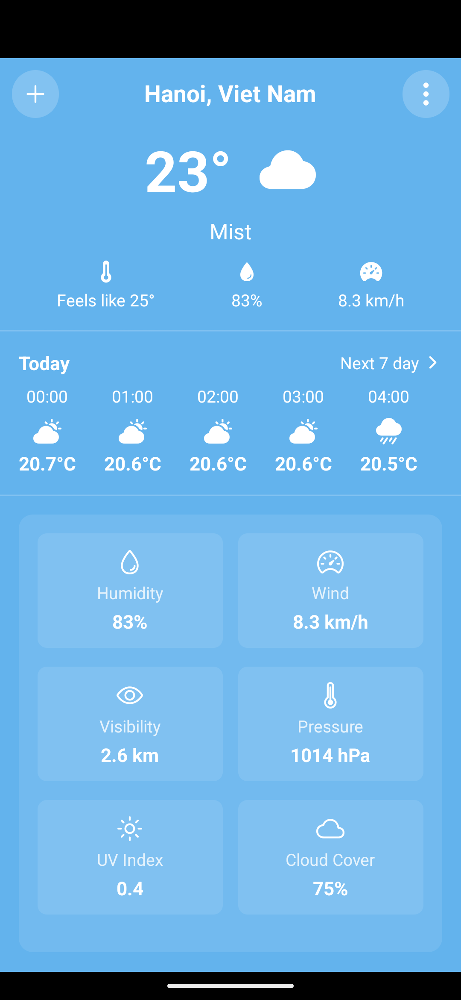
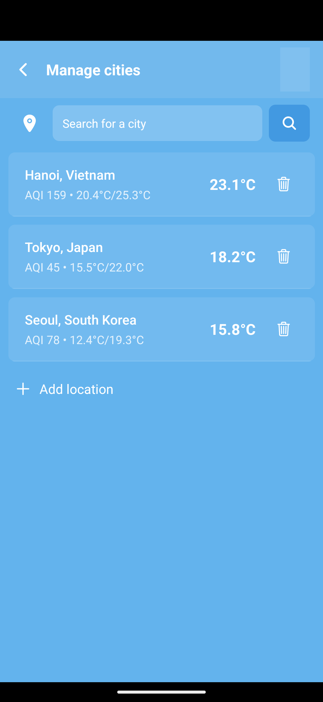
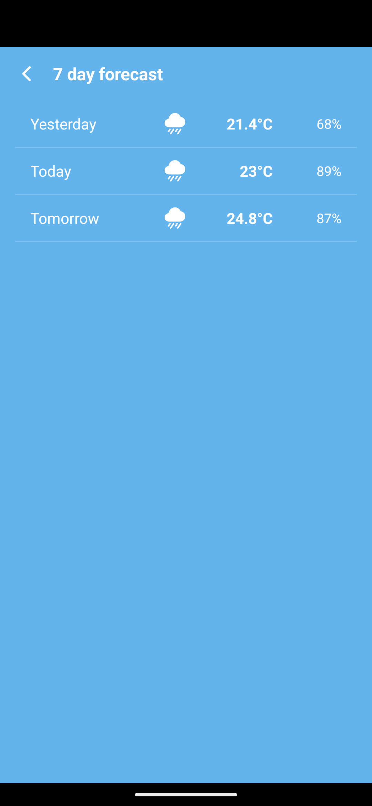

# 🌤️ Weather App

Ứng dụng thời tiết đơn giản với thông tin dự báo hàng ngày và hàng tuần. Được xây dựng bằng **React Native** và **Expo**.

---

## ⚙️ Yêu cầu hệ thống

- ✅ **Node.js** (phiên bản **16** trở lên)  
- ✅ **Android Studio** (để chạy máy ảo Android)  
- ✅ **Expo Go app** (nếu chạy trên điện thoại thật)

---

## 🚀 Cài đặt và chạy ứng dụng

### 1. Cài đặt Expo CLI

   npm install -g expo-cli

### 2. Clone dự án và cài đặt thư viện
   git clone https://github.com/PhucThinh2002/weather-mobile
   cd weather-app
   npm install

### 3. Cấu hình API Key
   ⚠️ Nếu API key bị hết hạn, bạn cần thay bằng key mới.

   - Mở file: services/api.ts
   - Tìm dòng:
         const API_KEY = 'dán_key_của_bạn_vào_đây';
   - Thay bằng key từ WeatherAPI.com

📱 Hướng dẫn chạy trên Android Studio

✅ Bước 1: Tạo máy ảo Android (AVD)
   Mở Android Studio
   Vào Device Manager → Tạo một máy ảo mới nếu chưa có

✅ Bước 2: Khởi động ứng dụng
   npx expo start

   Cửa sổ Expo hiện ra → Nhấn a để mở trên máy ảo Android
   Hoặc dùng điện thoại quét QR Code bằng app Expo Go

🧠 Lưu ý quan trọng
   ❗ Lỗi API
   Kiểm tra lại API key trong services/api.ts
   Lấy key mới tại WeatherAPI.com

   ⌨️ Phím tắt hữu ích khi chạy ứng dụng
      Phím	            Chức năng
      r	               Tải lại ứng dụng
      m	               Mở menu Developer
      Ctrl+C	         Dừng server Expo

🗂️ Cấu trúc thư mục chính

WEATHERAPP/
├── app/                          # App screens with file-based routing
│   ├── (tabs)/                   # Tab navigation screens
│   │   ├── _layout.tsx           # Tab layout configuration
│   │   ├── index.tsx             # Home screen (current weather)
│   │   ├── manage-locations.tsx  # Location management screen
│   │   └── weekly-forecast.tsx   # Weekly forecast screen
│   └── _layout.tsx               # Root layout
│
├── assets/                       # Static assets (images, fonts)
│
├── components/                   # Reusable UI components
│   ├── AddLocationButton.tsx
│   ├── CityItem.tsx
│   ├── DailyForecastItem.tsx
│   ├── HourlyForecast.tsx
│   ├── SectionHeader.tsx
│   └── WeatherCard.tsx
│
├── constants/                    # App constants
│   ├── config.ts
│   └── weathericons.ts
│
├── hooks/                        # Custom hooks
│   └── useWeather.ts
│
├── redux/                        # Redux state management
│   ├── slices/
│   │   ├── citiesSlice.ts
│   │   └── weatherSlice.ts
│   └── store.ts
│
├── services/                     # API services
│   ├── api.ts
│   └── weatherService.ts
│
├── types/                        # TypeScript type definitions
│   └── weather.d.ts
│
└── app.json

🖼️ Ảnh minh hoạ (Screenshots)
   
   
   